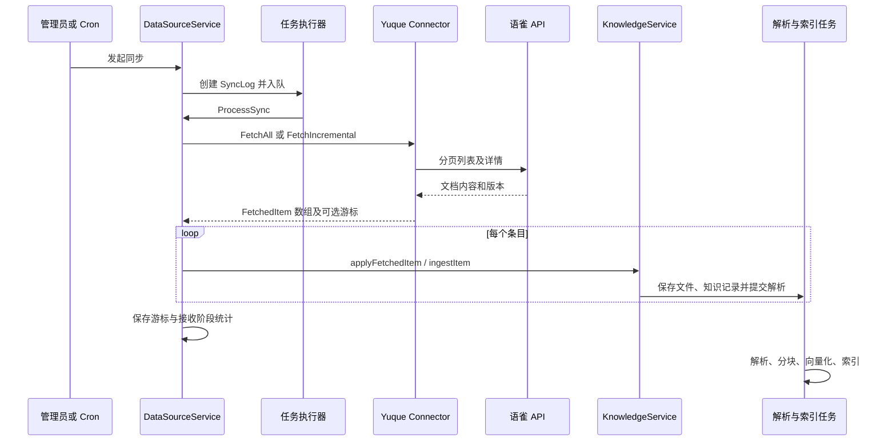
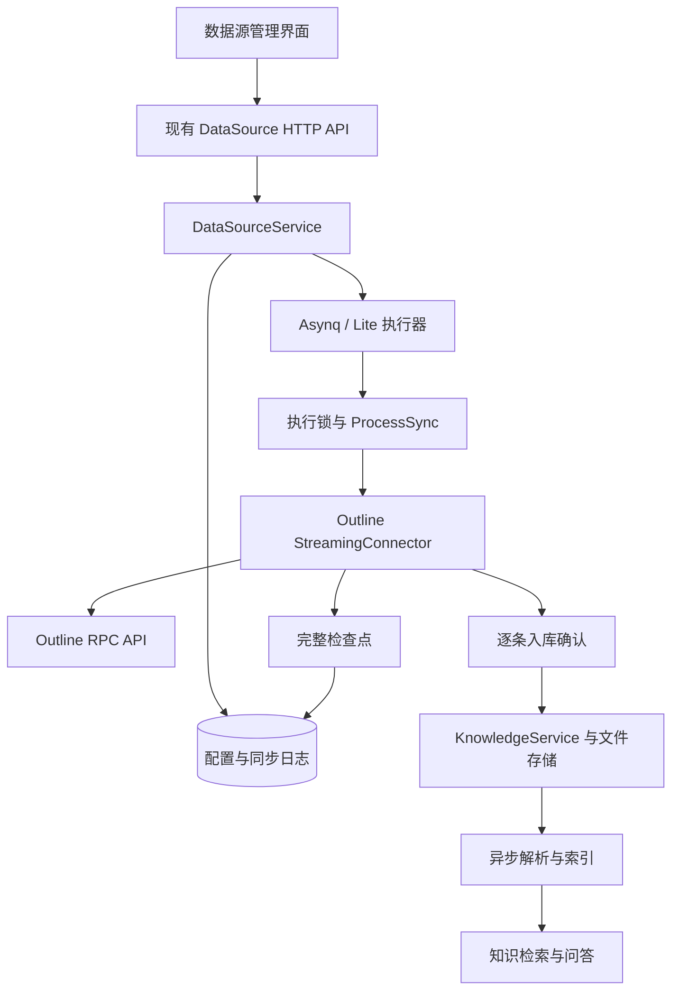

# Outline 数据源接入开发设计

| 文档属性 | 内容 |
| --- | --- |
| 版本 | 1.0，开发前设计稿 |
| 编写日期 | 2026-09-11 |
| 代码评估基线 | WeKnora commit `5db13a13` |
| 目标读者 | 后端、前端、测试、运维及技术评审人员 |
| 当前交付 | 开发设计与测试计划；本文描述的 Outline 功能尚未实现 |
| 配套文档 | [Outline 数据源接入测试计划](/Users/zhayinggang/Documents/github-project/WeKnora/docs/Outline数据源接入测试计划.md) |

## 1. 结论、范围与术语

### 1.1 设计结论

Outline 应作为独立 Connector 接入现有 DataSource 框架，复用配置、凭据、调度、知识入库、检索和问答。语雀提供了 API 适配与 Markdown 入库的参考，但其批量抓取和游标推进方式不适合直接用于万篇级同步。首期必须补齐逐条入库确认、全量基线保留、检查点恢复和安全删除对账。

本文用“现有行为”描述已经读到的代码，用“设计要求”描述待开发能力，用“首期限制”描述有意保留的边界。伪代码、JSON 和 Go 接口均为设计示例，不代表现有可调用实现。代码审查发现尚未通过本机运行测试复现：本次环境未找到可用 Go 命令，不将静态审查记为测试通过。

### 1.2 已确认的产品边界

| 维度 | 首期决定 |
| --- | --- |
| 部署 | 企业自托管优先；通过显式 Base URL 保留云端适配能力 |
| 认证 | API Key；建议专用同步账号，限制到必要读取端点 |
| 选择范围 | 多选 Collection；每个 Collection 包含所有层级的有效文档 |
| 有效文档 | 已发布、未归档、未删除、属于选中且有效 Collection 的文档 |
| 同步方向 | Outline → WeKnora，单向拉取 |
| 同步规模 | 每个数据源按 10,000 篇文档设计 |
| 内容 | Markdown 正文、标题、源时间、文档身份和原文链接 |
| 权限 | 导入后沿用 WeKnora 目标知识库权限，不同步源端用户 ACL |
| 删除 | 开启同步删除时，清理可确认已删除或退出有效范围的副本 |
| 大规模运行 | 流式入库、完整检查点、任务重试和失败项补偿 |
| 更新冲突 | 首期只支持源端覆盖，不展示尚未实现的 skip 策略 |
| 不纳入首期 | OAuth、Webhook、双向写回、用户身份映射、文档子树选择、私有附件下载与本地化 |

选择 Collection 并不将其变成 WeKnora 中独立的知识库。一个数据源属于一个目标知识库，可以将多个 Outline Collection 导入这个知识库。

### 1.3 术语及成功语义

| 术语 | 本文定义 |
| --- | --- |
| 外部身份 | Outline 文档 UUID；不使用标题、URL 或 Collection ID 作为文档身份 |
| 成功版本 | 内容已被 WeKnora 持久化并被解析流程接收的版本 |
| 完整扫描 | 本轮选中范围的资源检查、文档分页均成功结束；不等于每篇入库都成功 |
| 全量同步 | 强制重新处理选中范围全部有效文档，并保留历史身份用于删除对账 |
| 增量同步 | 扫描当前范围，仅对新增、变化和待重试文档执行入库 |
| 检查点 | 可独立恢复的完整状态；不是某一页的增量补丁 |
| 同步成功 | 内容接收阶段完成；后续异步解析仍以知识 parse_status 为准 |
| 可检索完成 | 知识解析、分块与必要索引完成，并通过检索验证 |
| 取消选择 | 用户取消勾选 Collection，停止后续同步并保留已导入副本 |
| 移出范围 | 源文档移动到未选 Collection，确认后按删除开关处理 |

## 2. 语雀现有接入评估

### 2.1 用户使用流程

管理员在目标知识库的编辑设置中进入“数据源”，选择语雀，填写 Token 和可选企业地址，测试连接后加载资源，勾选知识库并设置周期、模式和删除选项。保存后可以手动同步，也可以由 Cron 触发。同步日志展示接收阶段的新增、更新、删除、跳过和失败情况；知识列表另行显示解析状态。

这条链路直接调用语雀 API，不依赖 AnyDoc，也不是在每次问答时实时读取语雀。语雀内容先成为 WeKnora 知识，再通过通用检索与问答使用。来源渠道存放在 Knowledge.Channel；不能把 channel 标签与 Knowledge.Source 原文地址混为一谈。

### 2.2 模块与认证

| 环节 | 现有行为 | 代码依据 |
| --- | --- | --- |
| 前端入口 | 内置 yuque 选项，api_token 密码输入，可选 base_url；权限指引为 repo:read、doc:read | C01 |
| 后端注册 | ConnectorTypeYuque 和 NewConnector 注册到 ConnectorRegistry | C02、C03 |
| 配置解析 | 默认 https://www.yuque.com，规范化协议和斜杠，校验 SSRF | C04 |
| 认证请求 | X-Auth-Token；GET /api/v2/user 测试连接 | C05 |
| 个人账号资源 | 个人 repos 加所在 groups 的 repos，按 repo ID 去重 | C06 |
| 团队 Token | /user 返回 type=Group 时直接列举团队 repos | C06 |
| 可选资源 | 扁平 Book/Repo；选中值为数字 ID 字符串 | C06 |
| 凭据写入 | 配置了 SYSTEM_AES_KEY 才加密 Credentials 中的字符串值 | C07 |
| 凭据更新 | 独立 credentials 子资源整体替换，在线验证成功后保存 | C08 |
| API 返回 | DTO 构造时剥离 Credentials，只暴露 configured 元信息 | C09 |
| 权限 | 数据源修改、凭据、资源列举、同步操作为 Admin+，日志和普通读取为 Viewer+ | C10 |

### 2.3 同步与内容转换

资源列表通过用户或团队的 repos API 分页获取，并过滤 Book 类型。文档列表使用 `GET /api/v2/repos/{book_id}/docs`，详情使用 `GET /api/v2/repos/docs/{id}`。列表每页 100 条。每次详情请求前等待 300ms；客户端对 429、部分 5xx 和传输故障执行重试。

文档筛选接受 type=Doc、status=1；字段缺失时兼容放行。详情 format 为 markdown、lake 或空时读取 body；其他格式生成跳过条目。正文包装为安全文件名的 .md，设置 external_id、book_id、slug、creator、word_count 和 channel=yuque。私有图片仅保留源端引用，没有连接器级的认证下载保障。

增量通过 `BookDocTimes[book_id][doc_id] = content_updated_at` 比较版本。每轮仍扫描列表，仅变化文档读取详情。上一轮存在、本轮有效列表不存在的文档生成 IsDeleted 条目。FetchAll 只返回文档数组；FetchIncremental 才返回新游标和删除条目。语雀未实现 StreamingConnector。



标准模式由 Asynq 执行同步，配置 MaxRetry=5、Timeout=2h；Lite 由本地执行器分发。Lite 当前注入了自己的重试上下文，但同步流式入口仅从 Asynq 读取次数，不能直接假定二者的全量恢复语义一致。依据 C11、C12、C13。

知识更新按租户、知识库、数据源 ID、外部 ID 定位，现有方式是删除旧知识再创建。文件内容走 CreateKnowledgeFromFile；只有 URL 时才走 CreateKnowledgeFromURL。入库后按数据源名称自动打标签。依据 C11、C14、C15。

### 2.4 静态审查发现

以下“风险”均表示对应代码路径存在缺口，不表示已在生产或本机复现。

| 编号 | 触发条件与现有行为 | 影响 | 设计处理或建议 | 代码位置 |
| --- | --- | --- | --- | --- |
| YQ-01 | walk 先记录新 ContentUpdatedAt，再抓取详情；本轮部分失败、部分成功时服务仍可保存新游标 | 失败文档源端不再修改时，下一轮可能被跳过 | Outline 成功确认后才推进；语雀另列修复项 | C06，connector.go:202；C11:770 |
| YQ-02 | StreamHandler.Emit 对单篇入库失败计数后返回 nil | 流式连接器可能误认为已完成并推进检查点 | 新增可选 EmitWithResult，保持旧接口兼容 | C11:1003 |
| YQ-03 | FetchAll 不返回游标、不对比历史文档 | 强制全量无法建立新的完整删除基线；下一次增量仍可能使用旧基线 | Outline 全量保留历史身份并生成新检查点 | C06:143；C11:686 |
| YQ-04 | 先删旧知识，再创建新知识；部分查询、删除错误只记录日志 | 创建失败产生内容缺口，旧知识 ID 变化；异常情况下可能重复 | Outline 严格反馈错误和重试；首期仍保留替换窗口限制 | C11:1243 |
| YQ-05 | 文件去重只按知识库内 hash/type，不按来源身份限定 | 不同源文档相同正文可能被合并，后续删除归属不完整 | 增加可选来源身份去重参数 | C14:359；C15:90 |
| YQ-06 | FetchedItem 有 URL，但文件入库分支不自动持久化它 | 不能仅凭构造 URL 就宣称已支持原文跳转 | Outline 明确保存 metadata.source_url 并接入 UI | C06:261；C11:1298 |
| YQ-07 | 配置有 ConflictStrategy，入库逻辑未读取它进行分支 | 用户选择 skip 与实际行为可能不符 | Outline 仅接受和展示 overwrite | C11:1243；C02 |
| YQ-08 | HTTP 客户端打印最多 500 字节响应预览 | 日志可能含文档、用户或其他敏感响应内容 | 新连接器不记录响应正文；语雀另列日志收敛修复 | C05:101 |
| YQ-09 | 语雀先抓取全部正文，再开始入库 | 内存随总正文增长，中断后无法依靠中途入库检查点恢复 | Outline 按页处理和流式确认 | C06:150；C11:683 |
| YQ-10 | Token 未配置 AES 密钥时以明文透传存储 | “凭据始终加密”与实际部署条件不符 | 上线验收检查密钥与落库结果；不把可选加密描述成强制保障 | C07:531 |
| YQ-11 | 用户 group 列举任意错误均按空集合处理，单个 group 失败被跳过 | 资源发现不完整却可能缺少明确用户提示 | Outline 不把请求失败转换为空资源；部分失败可见 | C06:101 |
| YQ-12 | CreateKnowledgeFromFile 在任务入队失败时可能返回 knowledge,nil | 接收统计与真正可检索状态不一致 | 检查返回知识状态，区分接收与解析完成 | C15:234、252 |
| YQ-13 | 删除失败后新游标可能已经不包含文档 | 后续增量无法自动再次发出删除；语雀全量也没有通用删除兜底 | 待删除状态保留到成功或重新出现 | C11:860；C06:285 |

### 2.5 可直接复用与必须扩展

可以复用 DataSource/SyncLog 表、凭据子资源、RBAC、Cron、任务队列、知识解析、标签、SSRF 客户端及日志界面。必须扩展的是逐条处理反馈、Outline 全量检查点准备、来源身份去重、流式部分失败分类、手动 ForceFull 透传及数据源执行互斥。

不在首期重写全部连接器，不将 Outline 新规则隐式应用到所有旧连接器。共享入口的改动必须保留旧调用默认行为，并覆盖语雀、飞书、GitLab 等回归。

## 3. 需求编号与验收契约

| 需求 | 能力与验收结果 | 测试组 |
| --- | --- | --- |
| ODR-01 | 认证和配置：显式实例地址、原子凭据替换、实例身份校验 | CFG |
| ODR-02 | 资源发现：完整列举可见有效 Collection，所有文档层级均被扫描 | RES |
| ODR-03 | API 与内容：版本包装兼容、分页、Markdown、安全文件名和链接转换 | API、DOC |
| ODR-04 | 身份与来源：独立外部身份、隔离、来源时间及原文链接 | IDN |
| ODR-05 | 增量：正文及元信息变化被发现，无变化不重新解析 | SYN |
| ODR-06 | 全量：强制处理有效范围，并保留历史删除基线 | SYN |
| ODR-07 | 确认：失败不得推进成功版本，接收与解析状态区分 | ACK |
| ODR-08 | 恢复：完整检查点、待重试集合、标准和 Lite 恢复 | REC |
| ODR-09 | 删除：完整范围对账、跨集合移动、保守确认、删除重试 | DEL |
| ODR-10 | 生命周期：取消选择、删除开关、暂停、凭据变化、删除连接 | LIFE |
| ODR-11 | 并发：同一数据源串行执行、配置变更互斥、租约丢失停止 | CON |
| ODR-12 | 管理与界面：复用接口、ForceFull、来源入口、可操作错误 | UI |
| ODR-13 | 安全：SSRF、TLS、凭据、RBAC 和目标知识库权限 | SEC |
| ODR-14 | 可观察性：真实状态、限额错误样本、诊断指标 | OBS |
| ODR-15 | 容量：万篇级内存与游标有界，故障后收敛 | PERF |
| ODR-16 | 兼容与发布：旧接口、其他连接器、数据库和回退可用 | REG、REL |

## 4. 架构、配置与外部接口

### 4.1 组件职责

拟新增包：`internal/datasource/connector/outline/`。建议划分 client.go、types.go、connector.go、cursor.go、stream.go、errors.go 及对应测试。它们分别承担安全 HTTP、类型解析、框架适配、游标编解码、遍历与删除对账、错误分类。



框架注册增加 ConnectorTypeOutline、ChannelOutline 和容器注册，元数据声明 incremental、deletion_sync、api_key。生产路径实现 StreamingConnector；FetchAll/FetchIncremental 作为 Connector 契约的兼容方法，复用遍历器。批量适配器只表示“交付给调用方”，不得声称代表真实知识入库确认；服务检测到 Outline 必须采用流式路径。

### 4.2 配置模型

```json
{
  "name": "公司 Outline",
  "type": "outline",
  "config": {
    "type": "outline",
    "credentials": {
      "base_url": "https://outline.example.com",
      "api_key": "<通过安全界面填写>"
    },
    "resource_ids": ["11111111-1111-4111-8111-111111111111"],
    "settings": {}
  },
  "sync_schedule": "0 0 */6 * * *",
  "sync_mode": "incremental",
  "conflict_strategy": "overwrite",
  "sync_deletions": true
}
```

| 字段 | 校验和默认行为 |
| --- | --- |
| base_url | 必填实例根地址；缺协议补 https；去掉尾斜杠；拒绝 userinfo、query、fragment、/api 及其他子路径 |
| api_key | 非空字符串，去掉首尾空白；不以固定前缀或长度限制旧版本 |
| resource_ids | 去重的 Collection UUID；正式启用必须至少一项；不接受文档 ID 作为选择项 |
| settings | 首期为空；没有可由普通用户关闭安全检查的选项 |
| sync_schedule | 六段 Cron，默认每 6 小时；使用现有调度时区并在部署说明中记录 |
| sync_mode | incremental 或 full；默认 incremental |
| conflict_strategy | 首期只接受 overwrite；无效值返回配置错误 |
| sync_deletions | 默认 true；关闭后保留待删除身份而不是丢弃 |

Base URL 虽不是秘密，仍与 Key 一起存入 Credentials，以适配现有 credentials-only 测试接口和整体替换界面。编辑凭据需重新填写完整地址和 Key；响应不回显原值。Outline 的 configured 判断应检查有效 api_key 和 base_url，而不是仅检查 map 非空。

首次验证记录 Base URL、workspace ID。已绑定数据源更换 Base URL 或 workspace 时拒绝保存，提示创建新连接；不复用旧游标跨实例同步。同实例、同 workspace 轮换 Key 可接受。认证主体变化时清除本轮扫描及缺失确认计数，保留已入库身份，重新完整扫描，避免复用旧权限视图。身份信息仅保存非秘密标识。

新建向导为列资源创建的临时记录使用 paused、空 schedule、允许空 resource_ids；启用时再校验所选 Collection。临时记录不启动同步任务，取消向导按现有清理流程删除。不能因为禁止空正式范围而破坏现有“先连接、后选资源”的流程。

### 4.3 管理 API

沿用 `/api/v1/datasource`，不新增 Outline 专属路由。创建、详情、列表、凭据、resources、resource-ancestors、pause/resume、logs 使用已有结构。资源仍用通用 Resource；Outline 的 parentID 非空和祖先解析返回空数组。

手动同步请求增加可选字段，空请求体兼容旧客户端：

```http
POST /api/v1/datasource/{id}/sync
Content-Type: application/json

{"force_full":true}
```

Handler 校验布尔值并透传到已有 DataSourceSyncPayload.ForceFull。服务新增带选项的入口，旧 ManualSync 委托到 force_full=false，避免要求全部旧调用者改签名。返回继续是现有 SyncLog 响应。同步进行中再次触发或修改凭据/范围返回 HTTP 409 和稳定错误码 datasource_sync_running；后台计划任务遇到占用则跳过本次触发。

### 4.4 Outline API 契约

API Key 通过 `Authorization: Bearer` 发送，使用 POST JSON；不传 query token 或浏览器 Cookie。Key 可限制到具体端点，权限说明以此提供最小读取集合。[Outline 认证说明](https://docs.getoutline.com/s/guide/doc/api-1rEIXDfLF6)

| 方法 | 调用目的 | 请求重点 |
| --- | --- | --- |
| auth.info | 验证认证、识别用户和 workspace | 空对象 |
| collections.list | 分页列可见 Collection | limit、offset；不请求仅管理员可见的额外集合 |
| collections.info | 校验选择项和 Collection 状态 | id |
| documents.list | 扫描一个 Collection 全部层级 | collectionId、limit、offset、sort=createdAt、direction=ASC、statusFilter=[published] |
| documents.info | 补正文、复核移动/归档/缺失 | id |
| documents.deleted | 对候选缺失文档辅助确认软删除 | 分页读取删除集合，客户端仅匹配本数据源已知 ID |

前五项是基础读取能力；开启同步删除需要同时验证 documents.deleted 的可用性。发现该能力不支持或无权限时，不伪装删除同步可用：启用删除的配置验证失败；存量连接运行时失效则本轮保留副本、报告 partial。管理员可以显式关闭删除继续正文同步。集成账号不应为了查询 deleted 文档详情被要求授予恢复或写入权限。

连接测试先调用 auth.info 和 collections.list。范围选择完成后校验各 Collection，并用至少一个可见文档验证详情解析；合法空 Collection 通过连接验证，但日志说明尚无正文样本。删除能力检查使用 limit=1，不读取整个垃圾箱。完整删除列表仅在有需要辅助确认的缺失候选时读取，同一轮至多遍历一次并只保留候选 ID。

### 4.5 版本、分页与限流策略

固定发送 X-API-Version: 2，首期使用 Markdown 表达。详情解码兼容 data 为文档以及 data.document 两种形状。列表包含 text 时直接使用；字段不存在再读取详情；text 存在但为空是合法文档。若只有结构化 data，没有 text，不将 JSON 序列化为正文，返回格式不兼容错误。该策略依据官方的版本化序列化和路由包装行为。[文档序列化](https://github.com/outline/outline/blob/main/server/presenters/document.ts)、[文档路由](https://github.com/outline/outline/blob/main/server/routes/api/documents/documents.ts)

首期使用当前仍支持的 collectionId/statusFilter 参数，不与 filters 同传，也不发送未经目标版本验证的 modified_since。部分参数已被官方标为 deprecated，API v2 不是 Outline 产品版本号；不能据此承诺所有历史版本兼容。[请求 schema](https://github.com/outline/outline/blob/main/server/routes/api/documents/schema.ts)

默认页大小 25。优先使用可信 pagination.total/nextPath 的分页数值信息；没有总数时短页/空页结束。nextPath 只允许解析同端点的数值分页信息，不作为下一跳 URL。offset 必须严格前进；整页重复、提前空页与声明总数矛盾、解码失败均使扫描不完整。页间 UUID 重复允许去重，不能把少量重复误判为结束。Collection 内嵌文档通过不设置 parentDocumentId 获取；不用 sort=index，避免只取得树顶层或发生特殊分页语义。

| 参数 | 默认值与处理 |
| --- | --- |
| 单请求超时 | 30 秒，受任务 context 约束 |
| 初始页大小 | 25 |
| 响应上限 | 解压后最多 32 MiB；超过阈值读出错误，不静默截断 |
| 列表过大 | 同 offset 将 limit 减半重试，最低 1；单条仍过大则中止该 Collection 扫描并报告大小错误 |
| 单文档正文 | 最大 32 MiB，同时仍受知识库已有文件限制；详情超限计单篇失败 |
| 请求节流 | 默认 1 请求/秒、burst=1；进程内按规范地址和凭据不可逆摘要共用 limiter |
| 重试 | 初始请求后最多重试 3 次；网络错误及 5xx 使用 2/4/8 秒加抖动 |
| 429 | 优先遵循 Retry-After，兼容秒数和 HTTP-date；等待可取消，不超过任务剩余时间 |
| 401/403 | 不做 HTTP 层重试；401 终止任务，资源级 403 分类处理 |
| 跳转 | Outline API 请求拒绝跨源跳转；安全客户端仍检查同源跳转和最终拨号 |

Outline 的分页与 Retry-After 基础行为由官方规范定义；具体节流数值是本项目保守默认值，不是对账号配额的推断。多进程不会自动共享内存 limiter，跨实例竞争仍由 429 处理。[OpenAPI 规范](https://github.com/outline/openapi/blob/main/spec3.yml)

## 5. 文档映射、来源身份与入库

### 5.1 映射规则

| Outline 字段 | FetchedItem / Knowledge 目标 |
| --- | --- |
| id | ExternalID；metadata.external_id |
| collectionId | SourceResourceID；metadata.collection_id |
| title | Title；metadata.source_title；安全化文件名 |
| text | Content，ContentType=text/markdown |
| url | 解析成实例绝对地址，URL 和 metadata.source_url |
| createdAt/updatedAt | CreatedAt/UpdatedAt；源端时间按 UTC 保存 |
| revision | metadata.source_revision 与版本比较信号 |
| 本连接器计算的版本指纹 | metadata.source_fingerprint；用于检查点落盘前中断后的同版本幂等确认 |
| parentDocumentId | metadata.parent_document_id；不创建 WeKnora 文件夹层级 |
| workspace ID | metadata.outline_workspace_id |
| 固定 outline | metadata.channel，最终 Knowledge.Channel=outline |

服务继续补入 datasource_id 和 source_resource_id。普通 Source 字段不得被覆盖为渠道枚举。来源 URL 保存在独立元数据并供 UI 使用，不依赖文件上传分支自动保存 FetchedItem.URL。

正文使用转义后的标题构成一级标题，再追加 Markdown；合法空正文生成标题文档，避免走“仅 URL”分支。文件名替换路径字符、按 UTF-8 rune 边界截断；无标题使用 untitled。标题、同名文件和 URL 变化都不能改变外部身份。

相对链接按原文 URL 与实例根地址解析；锚点保留，合法 http/https 图片和附件链接转换为绝对地址。转换使用 Markdown 解析结果处理链接节点，不改代码块中的字符串。不得为链接附加 API Key；首期不为私有图片获取签名地址或下载附件，不承诺其在 WeKnora 中脱离 Outline 登录后可见。

### 5.2 身份与文件去重

身份键为 `(tenant_id, knowledge_base_id, datasource_id, external_id)`。文档 UUID 跨 Collection 保持稳定，移动仅改变 metadata。给 KnowledgeCheckParams 增加可选 DataSourceID、ExternalID；只有两项齐全时才启用来源身份限定，单项缺失视为调用错误。数据源文件入库显式传递这两项，普通上传不传，保持普通上传的原有去重语义。

同来源、同版本且已有 pending/processing/finalizing/completed 知识的重复投递，可确认 applied 而不删除重建。比较依据是知识元数据中已经持久化的 source_fingerprint，不能只依赖可能尚未落盘的连接器游标；缺少该字段时按需要重新处理。同来源已有 failed 知识时不能把它当作成功重复：对本次重新提交返回实际接收结果。不同源身份相同正文要保留各自知识，不能通过给正文添加虚构内容绕过去重。

首期仍使用已有替换入库链路，但 Outline 路径必须在查询旧记录或删除旧记录失败时停止本条并返回 failed。文件格式、大小和可执行的输入校验尽量前置。新建失败时不提交成功版本，下轮重试。原位原子替换及稳定知识 ID 不属于首期，不能承诺无检索空窗或旧知识引用 ID 永久稳定。

## 6. 流式确认、游标与恢复

### 6.1 可选接口扩展

保留现有 Connector、StreamingConnector、StreamHandler.Emit 签名。新增下列内部可选接口；未实现新接口的旧连接器保持旧路径：

```go
// 设计示例，不是已存在的实现。
type ApplyOutcome string // applied / deferred / failed

type ApplyResult struct {
    Outcome     ApplyOutcome
    KnowledgeID string
}

type AcknowledgingStreamHandler interface {
    StreamHandler
    EmitWithResult(ctx context.Context, item types.FetchedItem) (ApplyResult, error)
}

type FullSyncCursorPreparer interface {
    PrepareFullSyncCursor(previous *types.SyncCursor) (*types.SyncCursor, error)
}
```

| 结果 | 服务语义 | 游标动作 |
| --- | --- | --- |
| applied | 已接收新建/更新、同身份幂等重复、删除成功或已不存在 | 更新成功版本；已完成删除移除身份与待删除记录 |
| deferred | 同步删除关闭等明确保留策略 | 保留待处理身份，不确认删除成功 |
| failed | 抓取、入库、查找、删除、格式或入队失败 | 保留旧成功版本，登记待重试 |
| error 返回值非空 | context 取消、检查点不可写等运行级错误 | 中止本轮，最后成功检查点仍可恢复 |

private applyFetchedItem 逻辑返回结果并继续更新现有统计；旧 Emit 调用后忽略结果，以保留旧契约。不得调用两次 apply 导致重复计数。Outline 若未获得确认接口，应返回明确的框架配置错误，不能退化成“nil 等于成功”。

服务保留 CreateKnowledgeFromFile 返回的 Knowledge 对象。如果接口返回 nil error、但对象已被标记 parse_status=failed，确认结果仍为 failed。成功接收后发生的异步解析失败不回滚连接器游标，使用现有重解析入口恢复；UI 必须同时展示解析状态。若用户仅在 WeKnora 手工删除副本，增量游标可能仍跳过它，使用全量同步恢复，该边界在用户说明中写明。

### 6.2 游标结构

复用 SyncCursor.LastSyncTime 和 ConnectorCursor。内部序列化版本独立编号；不在游标保存 Token、正文或原始错误体。

```json
{
  "version": 1,
  "instance": {
    "base_url": "https://outline.example.com",
    "workspace_id": "workspace-uuid",
    "actor_id": "actor-uuid"
  },
  "selected_collection_ids": ["collection-uuid"],
  "last_complete_scan_at": "2026-09-11T00:00:00Z",
  "documents": {
    "document-uuid": {
      "collection_id": "collection-uuid",
      "fingerprint": "sha256:...",
      "knowledge_id": "knowledge-uuid"
    }
  },
  "run": {
    "id": "logical-run-uuid",
    "force_full": false,
    "completed_collection_ids": [],
    "seen_document_ids": [],
    "applied_fingerprints": {}
  },
  "pending_upserts": {},
  "pending_deletions": {}
}
```

示例中 UUID 占位符仅用于说明，不能直接用于配置请求。pending_upserts 记录文档 ID、已知 Collection 和安全错误码；pending_deletions 记录原 Collection、确认原因、连续完整扫描缺失次数、最近计数的 run ID。每次逻辑运行最多增加一次缺失计数，任务重试不算下一轮。

documents 保存已确认接收的版本；本轮看到但抓取失败的文档仍必须进入 seen_document_ids，不能被误判删除。applied_fingerprints 支持全量中断恢复：本轮已确认的相同版本可跳过，不能只靠 force_full 一律重抓已完成项。

fingerprint 是按固定字段顺序计算的 SHA-256，涵盖 updatedAt、revision、title、collectionId、parentDocumentId、规范化 url 和有效状态。缺少有效更新时间及 revision 时加入标准化正文哈希，不因空时间字符串相同就判定未变化。详情提供的版本优先于先前列表版本；下一轮列表落后时允许再次读取，不倒退已记录的详情版本。

未知游标版本或结构损坏返回 cursor_invalid，保留原游标供排查，不静默清空基线执行删除。人工重置基线只能走显式维护过程；“重新全量同步”不是破坏基线的重置按钮。

### 6.3 遍历与检查点顺序

```text
取得数据源执行权 → 读取配置 → 验证实例身份 → 准备或恢复 run
先重试 pending_upserts（重新校验文档状态及选中归属）
按排序后的 Collection ID 遍历尚未完成的 Collection：
    校验 Collection；分页读取文档
    记录 seen ID；构造当前版本指纹
    若无需处理：记录 unchanged，继续
    获取合法正文 → EmitWithResult
    applied：提交成功版本并清理该文档待更新状态
    failed：保留旧版本和待重试状态
    达到检查点阈值：同步保存完整游标
    完整读取该 Collection 后标记 completed
选中范围全部完成：复核并处理删除候选
保存完整扫描时间和最终游标 → 更新 SyncLog / DataSource
```

检查点每处理 50 篇或经过 30 秒时，在下一个安全边界同步保存；长退避等待按可取消的小段等待，在有新进度时保存状态。游标 Map 不与异步序列化并发修改。单篇外部调用仍受 30 秒上限约束，因此不把“30 秒检查”描述成任意阻塞下严格的持久化时限。

恢复未完成 Collection 时从 offset=0 重新读取，依靠已应用版本跳过，不能将旧 offset 当成稳定快照。已完成 Collection 可在同一 run 中复用扫描结果；删除前逐篇复核候选状态，下一正常运行重新扫描全部选中范围。这提供最终收敛，不提供 Outline 跨分页的事务快照。

详情请求失败、存储失败的单篇保留 pending，下次手动或计划运行重试；不新增独立的无限重试任务队列。Collection 级失败允许其他 Collection 继续，返回 PartialFetchError；服务流式入口需识别它、保存安全检查点并报告 partial。401、上下文取消和不可保存检查点属于运行级失败。全部可处理文档均失败时为 failed；存在部分成功或部分资源失败时为 partial；无有效文档且完整扫描成功可以为 success。

### 6.4 全量、关闭删除和配置变化

首轮强制全量先调用 PrepareFullSyncCursor：保留 documents、pending_deletions 和实例身份，清理旧 run 的进度并设置 force_full=true。同一任务重试不再次准备新基线；同时读取 Asynq 和 Lite 重试上下文，遵循对应执行器的重试次数。

取消选择 Collection 时，从活动扫描基线移除其身份并取消相应 pending，但不删除其 WeKnora 副本。重新选中后作为新范围全量扫描，通过稳定身份定位原有副本。新增 Collection 不得导致其他 Collection 的缺失计数增加。

关闭同步删除保留缺失身份与待删除项，状态为 deferred；再次开启时重新验证，不能直接执行陈旧 tombstone。文档重新出现时先取消待删除，再决定是否需要重新入库。同实例更换认证主体需重新完整扫描，并重置所有推断缺失证据。

## 7. 删除确认与生命周期

### 7.1 对账规则

删除候选从“仍被选择的历史文档”减去“本轮所有 Collection 的已见文档”得到。首先合并全局 UUID 集合再对账，禁止按 Collection 边扫边删。只允许删除当前数据源、当前租户和知识库拥有的知识。

详情请求的 403 不代表删除。Outline 官方加载已删除文档时会检查 restore 权限；应使用可用删除列表辅助确认，不能为此提高账号写权限。[文档加载实现](https://github.com/outline/outline/blob/main/server/commands/documentLoader.ts)、[文档权限定义](https://github.com/outline/outline/blob/main/server/policies/document.ts)

| 源端或用户操作 | 删除开关打开时 | 删除开关关闭时 |
| --- | --- | --- |
| 已选 A → 已选 B | 同 UUID 更新归属，绝不删除；即使 B 的正文处理失败也只重试更新 | 相同 |
| 移到未选 Collection | 详情确认新归属后清理 | 保留并登记 deferred |
| 文档归档、撤回发布 | 详情明确确认后清理 | 保留并登记 deferred |
| 删除列表明确包含文档 | 清理；删除失败保留 pending | 保留并登记 deferred |
| 原生 Outline 404，且实例已通过错误契约测试 | 同身份、同范围、认证及原 Collection 正常，连续两轮完整扫描仍缺失才清理 | 保留 |
| 403、网关 404、HTML、未知错误体 | 保留、报告原因；不累加“明确不存在”证据 | 保留、报告原因 |
| Collection 请求超时、分页不完整 | 整轮禁止删除对账，保留历史基线 | 相同 |
| Collection 明确归档且详情仍可读取 | 视为该集合内容退出有效范围；仍需全局合并其他选中集合与逐篇核验后清理 | 保留 |
| Collection 已删除或不可见，无法取得可靠状态 | 保留其副本并报告资源异常；不把整集合 404 当成所有文档删除证明 | 相同 |
| 用户取消勾选 Collection | 停止同步，保留副本，移出活动基线 | 相同 |
| 删除数据源连接 | 停止后续同步，保留知识；不借机批量清库 | 相同 |

404 判定仅适用于实测能区分“无记录”和“无权限”的原生 JSON 契约。没有通过该契约测试的部署禁用推断删除，但仍可同步明确删除、归档和移出范围。两轮缺失不是所有网关环境下的权限证明；文档保留并提示人工核查优于未知状态下误删。

删除前再次检查文档是否已恢复或移动到选中范围。未知权限状态、Token 变化、范围变化、任何完整性错误均打断连续缺失证据。按每 6 小时默认周期，推断删除通常需要两个完整周期，不能描述为实时删除。

### 7.2 暂停、删除与并发

标准模式按 tenant+datasource 使用 Redis SET NX 租约，随机所有者 Token，租期 120 秒、30 秒续约，释放和续约使用所有者比较。手动与定时入口共享执行互斥。执行阶段再次取得锁，防止仅靠入队检查留下并发窗口；重复手动请求返回 409，重复后台任务按跳过处理，不改写正在运行的日志。

凭据、范围和同步模式修改与运行使用同一互斥入口；运行中拒绝修改，防止旧配置落盘覆盖新配置。暂停只阻止后续计划任务，不等于中止当前任务；显式任务取消才中断当前执行。删除连接会使任务在安全边界检查存活状态并停止发出新操作，已成功入库内容保留。

失去续约时取消任务上下文，在下一次 Emit/Checkpoint/删除前校验所有权并停止，不释放其他持有者的锁。租约不是数据库级 fencing：任意长进程停顿或不响应 context 的外部写入仍可能形成交接窗口。首期遇到此类强接管故障应先终止旧 worker 再恢复；不能宣称获得任意故障下的线性一致性。

Lite 使用按数据源的进程内锁，首期支持单实例 Lite。由服务为同步 context 设置 2 小时上限，以补足本地执行器并未普遍实现 Asynq Timeout 语义的差异；不改写所有 Lite 任务。标准模式和 Lite 均须测试重试计数、取消及全量恢复。

## 8. 前端、持久化、安全与可观察性

### 8.1 前端与用户说明

在现有向导增加 Outline 项、图标、Base URL 和 Key 字段、Collection 多选与权限指引。所有凭据仍只发往后端。测试连接成功后才能加载资源；资源失败保留错误而不是展示空列表成功。编辑界面采用已有“凭据已配置/替换凭据”交互。

提供“立即同步”“重新全量同步”；第二个只设置单次任务 force_full，不改变长期模式。来源列表支持 outline 筛选、渠道标识，文档详情/列表提供打开 source_url 的入口。链接打开继续由 Outline 自己校验登录权限。

提示“导入后按目标知识库权限访问”“关闭删除会保留历史副本”“私有附件不随正文下载”。同步结果页显示 partial 原因和失败样本；知识解析失败另行展示，不能以 SyncLog.success 覆盖。新增文案覆盖现有所有 locale，执行语言键审计，不显示裸错误码。

### 8.2 数据库存储与兼容

不新增 Outline 业务表，DataSource.Config、LastSyncCursor 和 SyncLog.Result 使用现有 JSON 字段；Knowledge.Metadata 保存来源信息。现有 DTO 会返回 LastSyncCursor，因此游标必须无秘密，管理界面不将其作为面向用户的配置展示。

PostgreSQL 已有按 knowledge_base_id 和 metadata.external_id 的表达式索引（C19），先复用，并通过 EXPLAIN 验证身份查询命中；不能未经评估重复添加同类索引。SQLite 增加与查询表达式一致的非唯一、未删除记录外部 ID 索引，通过现有 SQLite 版本迁移交付 up/down。迁移仅新增索引，不重写存量业务数据。

### 8.3 安全要求

- Base URL 校验、每次请求及拨号使用现有 SSRF 安全机制；私网通过系统管理员精确白名单放行。连接器表单不提供跳过 SSRF 选项。
- 正式部署使用 HTTPS；显式 HTTP 仅允许受信且在白名单中的内网目标，界面提示传输方式。不能将所有公网 HTTP 目标因某条宽泛白名单自动视为受信部署。
- 内部 CA 通过操作系统/容器信任链配置，不使用 InsecureSkipVerify。拒绝跨源 API 重定向，不向第三方转发认证头。
- 上线配置 SYSTEM_AES_KEY，验证凭据密文写入和响应剥离；生产日志不含 Token、正文、响应体或 Cookie。
- 资源、凭据、同步控制沿用 Admin+。用户能导入哪些数据由 Outline 凭据决定；导入后谁能读取由目标 WeKnora 知识库决定，两者不做隐式 ACL 继承。
- 源端撤销用户权限不会立即撤回目标知识库成员的读取权；遇到不可确认的权限状态仍会保留副本，这是已选择的管理员受控导入模型边界。

### 8.4 错误和指标

| 错误类别 | 推荐稳定码 | 处理 |
| --- | --- | --- |
| 认证无效 | outline_auth_failed | 终止运行、保留游标，提示换 Key |
| 资源权限不足 | outline_permission_denied | 保留相关副本、partial，避免误删 |
| 限流 | outline_rate_limited | 有界等待和重试，耗尽后失败 |
| 响应/格式不兼容 | outline_response_invalid / outline_format_unsupported | 不入库错误内容、不推进成功版本 |
| 分页不完整 | outline_scan_incomplete | 继续其他资源、禁止本轮删除 |
| 实例变化 | outline_instance_changed | 拒绝复用配置，要求新连接 |
| 正文超限 | outline_document_too_large | 保留失败项，无截断成功 |
| 游标损坏 | outline_cursor_invalid | 停止运行，保留原状态 |
| 入库或删除失败 | ingest_failed / deletion_failed | pending 重试 |

日志只记录 ds_id、collection_id、document_id、方法名、HTTP 状态、耗时、重试次数和稳定错误码。服务现有错误样本上限 100 条仍生效；完整 pending 状态不受该展示上限截断。

结构化统计记录 discovered、unchanged、emitted、pending_upserts、pending_deletions、api_requests、retry_count、rate_limit_wait_ms、cursor_bytes、checkpoint_duration_ms。discovered 是扫描量，SyncResult.Total 延续实际交付处理条目数；二者不能混用来宣称“未变化文档丢失”。删除关闭的 deferred 单独记录，不计删除成功。

## 9. 容量、实施顺序与发布

### 9.1 容量目标

运行时正文只保留当前页及当前处理条目，元数据内存为 O(N)，不承诺总内存 O(1)。10,000 篇常规文档的单份游标目标不超过 10 MiB。检查点是完整快照，必须记录实际大小和写耗时；若超过目标，应缩减冗余状态而不是丢弃 pending 或已知身份。

Outline v2 列表可能已经返回全文。增量保证减少重新入库和索引工作，不保证外部网络仅传变化正文。性能报告分开记录 API 扫描、文件接收与解析索引耗时。默认 1 请求/秒下，25 条每页扫描 10,000 篇至少约 400 次列表请求；详情补取、删除复核、限流和下游处理会增加耗时。不得凭该算式承诺固定完成时间。

性能验收的数据分布、指标和故障注入见配套测试计划。UI 应持续反映已接收进度；同步结束不替代解析完成验收。

### 9.2 开发任务及依赖

| 阶段 | 拟开发工作 | 依赖 | 交付检查 |
| --- | --- | --- | --- |
| A | 固定 API fixtures、配置和错误契约；复核目标部署版本 | 无 | 基础认证、分页及删除错误可区分 |
| B | 逐条确认、全量准备、来源去重、流式 partial 处理 | A | ACK/IDN/REG 测试通过 |
| C | Outline 客户端、资源、正文映射、游标、删除对账 | A、B | API/RES/DOC/SYN/DEL 通过 |
| D | 运行锁、配置互斥、Lite 恢复、SQLite 索引 | B、C | REC/CON/LIFE 通过 |
| E | 前端向导、来源入口、ForceFull、文案 | A，联调依赖 C | UI/SEC 通过 |
| F | 固定版本联调、万篇级压测、文档与回退演练 | C、D、E | PERF/REL 和全部 P0 用例通过 |

工作量估算 12～18 人日：后端及公共能力约 7～10、前端约 2～3、测试联调与运维文档约 3～5。估算不代表发布承诺，真实实例网关、版本和账号权限差异可能增加联调成本。

### 9.3 发布与回退

先在受控知识库选择少量 Collection 验证接收、解析、引用和删除，再扩大范围。发布准入必须记录 WeKnora SHA、Outline 产品 tag/commit、镜像 digest、API 头、数据库及队列模式，不能使用未固定的 latest 或 main 作为“已验证版本”。

回退时先暂停 Outline、等待或取消在途任务，再关闭入口/恢复上一个应用版本。保留已导入知识、配置和游标；旧版本没有 Outline 注册时不得继续调度其任务。SQLite 索引可以保留，执行 down 只删除新增索引。公共接口是可选扩展，旧连接器仍可工作。重新上线恢复旧游标版本时先验证兼容，不静默清除状态。

首期不包含历史语雀数据修复。YQ-01、YQ-08、YQ-13 应独立跟踪；公共代码改动覆盖回归，不能把“给 Outline 设计了解决办法”写成“语雀问题已经修复”。

后续方向依次为稳定知识 ID 的原位替换、私有附件本地化、文档子树选择、Webhook 触发加定期对账、OAuth 与用户级权限同步。每项均需要独立产品与测试设计。

## 10. 代码依据与外部参考

### 10.1 当前仓库依据

行号基于 `5db13a13`；以后变动时以表中符号及职责定位。以下均为真实现有文件；第 4.1 节的 Outline 包是待新增位置。

| 编号 | 位置 | 主要依据 |
| --- | --- | --- |
| C01 | [DataSourceEditorDialog.vue:589](/Users/zhayinggang/Documents/github-project/WeKnora/frontend/src/views/knowledge/settings/DataSourceEditorDialog.vue:589) | 语雀表单、凭据字段与权限提示 |
| C02 | [datasource.go:30](/Users/zhayinggang/Documents/github-project/WeKnora/internal/types/datasource.go:30) | 类型常量、配置、状态及游标结构 |
| C03 | [container.go:1669](/Users/zhayinggang/Documents/github-project/WeKnora/internal/container/container.go:1669) | 实际连接器注册 |
| C04 | [yuque/types.go:36](/Users/zhayinggang/Documents/github-project/WeKnora/internal/datasource/connector/yuque/types.go:36) | 配置、默认地址和状态兼容解析 |
| C05 | [yuque/client.go:47](/Users/zhayinggang/Documents/github-project/WeKnora/internal/datasource/connector/yuque/client.go:47) | HTTP、重试、响应日志与分页 |
| C06 | [yuque/connector.go:53](/Users/zhayinggang/Documents/github-project/WeKnora/internal/datasource/connector/yuque/connector.go:53) | 资源、正文、游标和删除检测 |
| C07 | [datasource.go:531](/Users/zhayinggang/Documents/github-project/WeKnora/internal/types/datasource.go:531) | 条件加密与 ParseConfig 解密 |
| C08 | [datasource_service.go:240](/Users/zhayinggang/Documents/github-project/WeKnora/internal/application/service/datasource_service.go:240) | 凭据验证后整体保存 |
| C09 | [dto/datasource.go:57](/Users/zhayinggang/Documents/github-project/WeKnora/internal/handler/dto/datasource.go:57) | 响应凭据剥离，游标仍在响应中 |
| C10 | [routes_infra.go:292](/Users/zhayinggang/Documents/github-project/WeKnora/internal/router/routes_infra.go:292) | 数据源路由与 RBAC |
| C11 | [datasource_service.go:590](/Users/zhayinggang/Documents/github-project/WeKnora/internal/application/service/datasource_service.go:590) | 批量、流式、统计、确认缺口及入库 |
| C12 | [scheduler.go:44](/Users/zhayinggang/Documents/github-project/WeKnora/internal/datasource/scheduler.go:44) | 六段 Cron、计划任务去重 |
| C13 | [sync_task.go:102](/Users/zhayinggang/Documents/github-project/WeKnora/internal/router/sync_task.go:102) | Lite 重试上下文与本地执行器 |
| C14 | [knowledge.go:359](/Users/zhayinggang/Documents/github-project/WeKnora/internal/application/repository/knowledge.go:359) | 文件去重及来源身份查询 |
| C15 | [knowledge_create.go:25](/Users/zhayinggang/Documents/github-project/WeKnora/internal/application/service/knowledge_create.go:25) | 文件创建、异步解析提交和入队失败行为 |
| C16 | [connector.go](/Users/zhayinggang/Documents/github-project/WeKnora/internal/datasource/connector.go) | Connector、StreamingConnector、StreamHandler 和元数据 |
| C17 | [httpclient.go:14](/Users/zhayinggang/Documents/github-project/WeKnora/internal/datasource/httpclient.go:14) | 连接器 SSRF 入口 |
| C18 | [security.go](/Users/zhayinggang/Documents/github-project/WeKnora/internal/utils/security.go) | 白名单、重定向和拨号安全 |
| C19 | [外部 ID 索引迁移](/Users/zhayinggang/Documents/github-project/WeKnora/migrations/versioned/000076_knowledge_metadata_external_id_index.up.sql) | 已有 PostgreSQL 表达式索引 |
| C20 | [datasource_stream_test.go](/Users/zhayinggang/Documents/github-project/WeKnora/internal/application/service/datasource_stream_test.go) | 现有流式全量及重试契约 |

### 10.2 官方参考与证据限制

上述外部结论来自 Outline 官方文档或官方仓库，并在相关段落就近引用。资源发现另可核对 [Collection 路由](https://github.com/outline/outline/blob/main/server/routes/api/collections/collections.ts) 和 [Collection 序列化](https://github.com/outline/outline/blob/main/server/presenters/collection.ts)。参考访问日期为 2026-09-11；main 分支仅是设计研究依据，不是兼容性认证。

本次没有访问真实 Outline 或语雀租户，没有使用真实 API Key，没有运行源端写操作，没有实施本设计，也没有执行配套功能测试。正式开发前将目标实例的读取响应录制为脱敏、固定版本的 fixtures，所有实测兼容结论写入测试报告。
